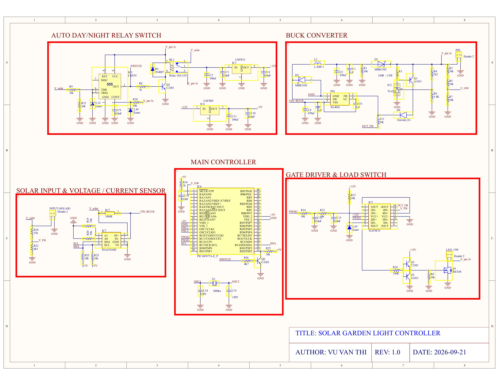

# ☀️ MPPT Solar Charger & Garden Light Controller 

[](#)
[](#)
[](#)
[](#)

Hệ thống điều khiển sạc pin năng lượng mặt trời tự động tối ưu công suất cực đại sử dụng thuật toán **MPPT Incremental Conductance (IncCond)**, kết hợp cảm biến dòng/áp **INA219 (I2C)**, bộ hạ áp Buck Converter và tự động bật/tắt đèn sân vườn ban đêm.

---

## 📌 Điểm Nổi Bật Kỹ Thuật (Key Features)


* **Thuật Toán MPPT Incremental Conductance (IncCond):** 
  * Liên tục tính toán $dI/dV$ và $-I/V$ từ dữ liệu cảm biến INA219 để xác định chính xác điểm công suất cực đại (MPP) của tấm pin mặt trời.
  * Khắc phục hoàn toàn nhược điểm dao động quanh điểm MPP của thuật toán Perturb & Observe (P&O) truyền thống khi cường độ bức xạ ánh sáng thay đổi đột ngột.
* **Đo Lường & Giám Sát Chi Tiết:**
  * Cảm biến **INA219** giao tiếp I2C tốc độ cao giúp theo dõi chính xác điện áp ($V_{solar}$), dòng điện sạc ($I_{charge}$) và công suất sạc ($P_{solar}$).
* **Điều Khiển Sạc & Tải Công Suất:**
  * Module PWM điều chỉnh chu kỳ xung kích mở tầng công suất Buck Converter qua DAC / Gate Driver.
  * Khối chuyển mạch tự động phát hiện trạng thái Ngày/Đêm để đóng cắt đèn LED chiếu sáng ban đêm.

---

## 📐 Sơ Đồ Nguyên Lý (Schematic Architecture)

Sơ đồ nguyên lý được phân chia thành các khối chức năng chính:


1. **SOLAR INPUT & INA219 SENSOR:** Đầu vào Solar và cảm biến dòng/áp INA219 giao tiếp I2C.
2. **BUCK CONVERTER & GATE DRIVER:** Mạch hạ áp Buck và tầng lái công suất.
3. **MAIN CONTROLLER:** Khối vi điều khiển PIC, thạch anh, nút bấm Reset và cổng nạp ICSP.
4. **AUTO DAY/NIGHT SWITCH:** Cảm biến chuyển trạng thái sạc ngày và bật đèn đêm.

---

## 🛠️ Cấu Trúc Thư Mục Repository

```text
├── Hardware/                # File sơ đồ mạch nguyên lý
├── Firmware/                # Mã nguồn C điều khiển thuật toán MPPT & Peripheral
│   ├── MPPT-control.c      # Chương trình chính (Main) & Thuật toán IncCond
│   ├── INA219.c / .h        # Driver đọc cảm biến dòng/áp I2C
│   ├── PWM.c / .h           # Điều khiển xung PWM
│   └── i2c.c / .h           # Thư viện giao tiếp I2C
├── docs/                    # Hình ảnh minh họa dự án
│   ├── MPPT_IRC.png         # Biểu đồ đặc tuyến MPPT IncCond
│   └── schematic.jpg        # Ảnh sơ đồ nguyên lý
└── README.md                # Tài liệu hướng dẫn dự án
